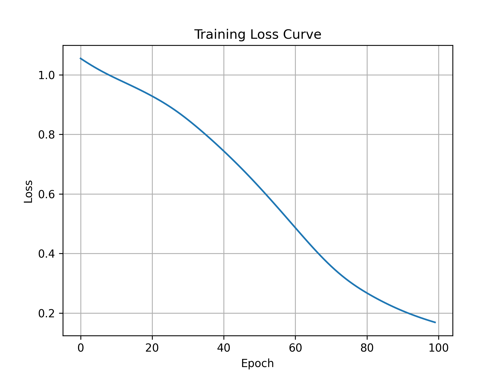
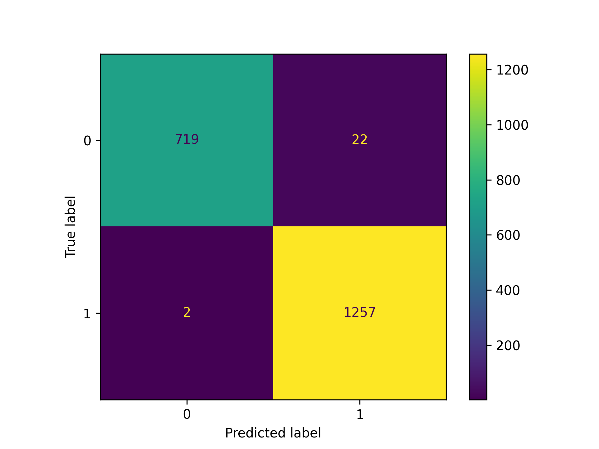
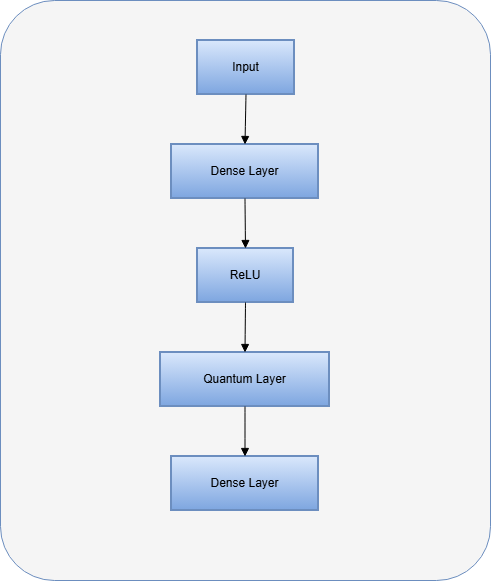

# 🚀 Quantum-Inspired Fault Detection

## 📌 Overview
Hybrid Quantum-Classical ML model for fault detection in power systems.

## ⚙️ Tech Stack
- Python
- PyTorch
- PennyLane
- Scikit-learn

## 🧠 Model Architecture
- Classical NN + Quantum Layer
- Angle embedding + entanglement

## 📊 Results
- Accuracy: 98.5%

## 📉 Loss Curve

## 📊 Confusion Matrix
 

## 🧠 Architecture Diagram

